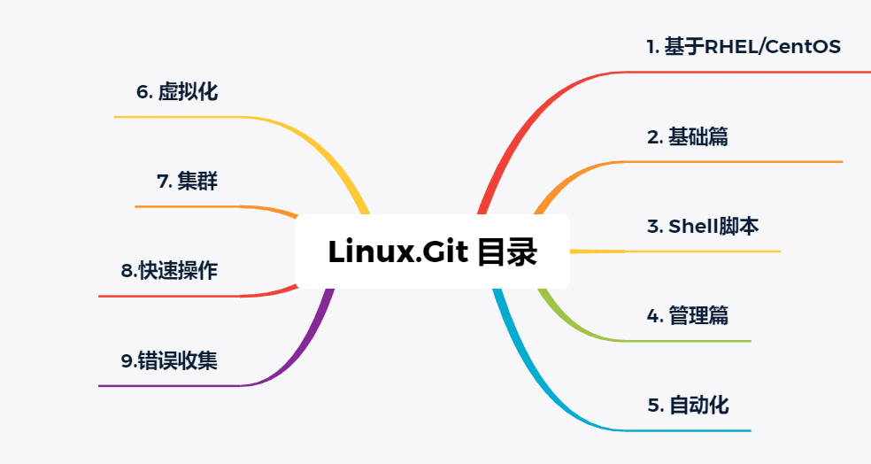

# Linux 学习和实践记录

## 介绍

您好！我是 apnpc ，这是我的一点点学习和工作记录，如果您有任何问题以及发现我的错误，请在 Issues 中反馈。感谢！

希望这些能对您有所帮助。

## 一点我个人的经验

- 1.学习本来就是枯燥乏味的。当你觉得很苦的时候，请告诉自己，学习本来就是苦的，无所谓，心态~ 继续肝！

- 2.学习的时候不要通篇复制命令，不要复制，不要复制。这是技术活，如何才能干好技术活？脑袋里有东西，手上有家伙。

- 3.如果遇到不懂的，可以找资料，如果花费很长时间还“没有”找到解决办法，请继续往下走，不要钻牛角尖，后面的内容会让你顿悟。

- 4.提问的技巧 参考：[How-To-Ask-Questions-The-Smart-Way](https://github.com/ryanhanwu/How-To-Ask-Questions-The-Smart-Way/blob/master/README-zh_CN.md)

## Linux 版本信息

- Linux 版本：RHEL/CentOS 7.8

## 计划内容

## 更新进度

| 项目   | 更新内容     | 更新日期      |
| ------ | ----------- | ------------- |
| 基础篇 | 操作系统概述 | 2020-08-26  |

## 目录介绍

### 1. 基础篇

#### 1.1 操作系统概述
